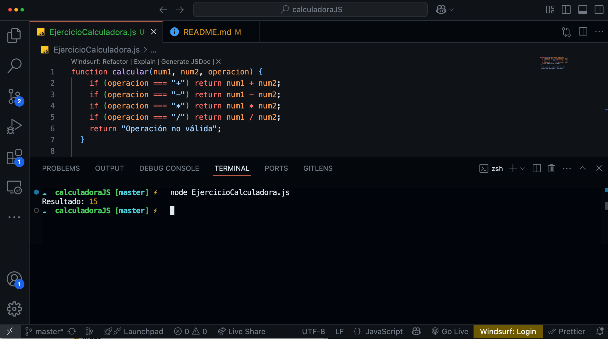

# 🧮 Calculadora en JavaScript

Este proyecto es una **calculadora** creada con JavaScript puro. Permite realizar operaciones matemáticas simples como suma, resta, multiplicación y división.

## 🚀 Funcionalidades

- ✅ Suma (`+`)
- ✅ Resta (`-`)
- ✅ Multiplicación (`*`)
- ✅ División (`/`)

## 💻 Código base

function calcular(num1, num2, operacion) {
  if (operacion === "+") return num1 + num2;
  if (operacion === "-") return num1 - num2;
  if (operacion === "*") return num1 * num2;
  if (operacion === "/") return num1 / num2;
  return "Operación no válida";
}

const resultado = calcular(10, 5, "+");
console.log("Resultado:", resultado); 
